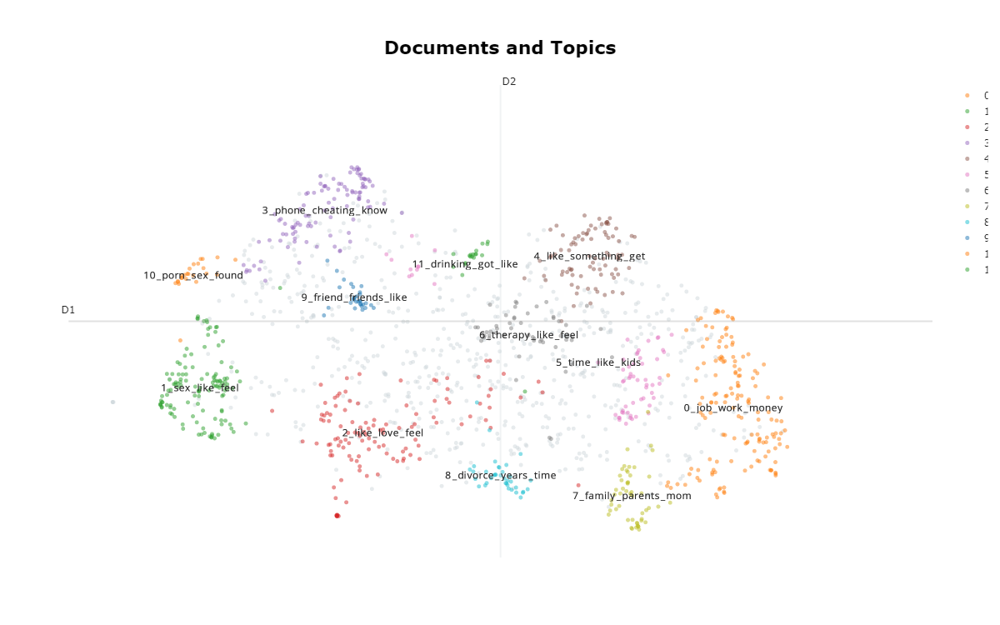
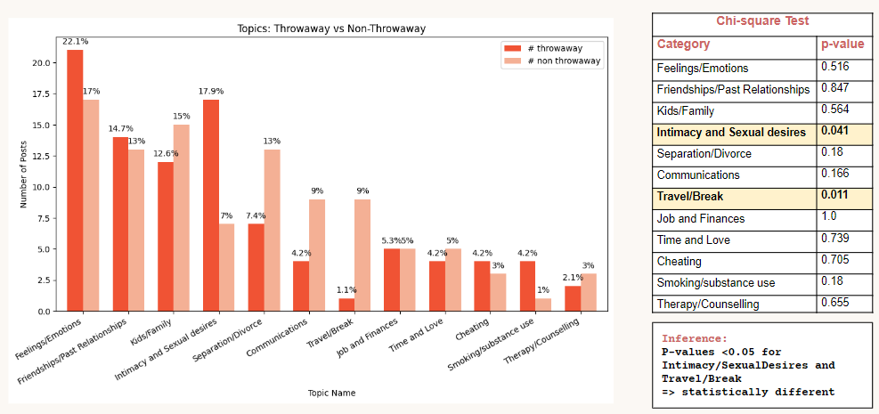

# Topic-Modeling-Reddit-Advice-Seeking

- Motivation: Reaching out to real-life close acquaintances such as friends or family to discuss sensitive topics about marriage is difficult in the offline world. With the benefits of social platforms, anonymity, and insights from diverse individuals, people are leveraging these platforms to seek marriage advice. 

## Goal:
To analyze how anonymity on social platforms encourages people to disclose sensitive topics related to their marriage: what topics people discuss when being anonymous.

## Data Collection:
Used the Python Reddit API Wrapper (PRAW) to gather posts from two marriage subreddits and collected a total of 1449 posts between October 2022 to March 2023.

## Methodology:
Used BERTopic modeling algorithm which can be applied in an unsupervised setting, and clustered various category of topics that are discussed by people.

## Sampled dataset for analyzing role of true anonymity
The datasets were sampled to have equal amounts of throwaway (true anonymous accounts) and non-throwaway (pseudonymous accounts) and the topic names are manually assigned based on top representative words.

## Conclusion:
Chi-square tests revealed that sensitive topics Intimacy is mostly discussed using throwaway posts (p = 0.041), and general topics like Travel/Break are discussed using non-throwaway posts (p = 0.011).
